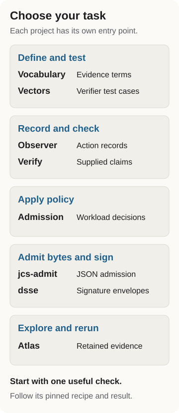

# Probity AI

Check claims about agent actions.

Probity builds evidence tools for agent harnesses, reviewers and platform teams. Use them to define claims, test verifiers, inspect action records and apply workload policy.

[Choose a project](start.md) for your task, or [find a retained run](runs.md) by its claims, roles and limits.

## The public code

| Task | Start with |
|----|----|
| Define an evidence claim | [Vocabulary](start.md#vocabulary) |
| Test a verifier | [Vectors](start.md#vectors) |
| Record file actions or check delegation runs | [Observer](start.md#observer) |
| Check a supplied claim | [Verify](start.md#verify) |
| Apply workload admission policy | [Admission](start.md#admission) |
| Work with canonical JSON or signature envelopes | [jcs-admit](start.md#jcs-admit) and [dsse](start.md#dsse) |

The task page links a pinned quickstart for each project. For scripts and agents, use the [automation guide](automation.md), [llms.txt](llms.txt) or [project catalog](catalog.json).

<figure>

<figcaption aria-hidden="true">Choose by task: Vocabulary defines evidence terms; Vectors tests verifier cases; Observer records actions; Verify checks supplied claims; Admission applies workload policy; jcs-admit handles canonical JSON; dsse handles signature envelopes; Atlas publishes mechanisms and retained runs. These are entry points, not a required sequence.</figcaption>
</figure>

[Replay an evidence decision](replay-an-evidence-decision.md) to inspect a retained signed packet, admit it once and reproduce the replay, authority and signature refusals. The walkthrough checks the decision from recorded bytes; it does not execute the original agent action.

Inspect accepted our [bounded native result reader listing](https://github.com/UKGovernmentBEIS/inspect_ai/blob/c9f2d1cadb5e46cd8b89d217c7a2a1f816bce057/docs/extensions/extensions.json) on October 3, 2026. The [live extensions catalog](https://inspect.aisi.org.uk/extensions/) still shows the earlier published source (checked October 5). [Read the pinned consumer guide](https://github.com/probityai/agent-evidence-observer/blob/71ac0b2126473316655184235000647a6dd0f5cf/docs/NATIVE-CONSUMER-CI.md).

## Agent action assurance

The [assurance atlas](atlas.md) maps the mechanisms teams use to control agents and check their actions. The [Open Evidence Lab](lab.md) publishes run artifacts, replay commands and review state. [Experiments](experiments.md) document the procedure behind each recorded check.

Sources and re-derive commands live in the [claim ledger](claims.md). The [version ledger](versions.md) records each artifact and its release state.

## Research

*Three Jobs, Not One* explains why deciding, containing and witnessing agent execution need separate mechanisms ([Zenodo](https://doi.org/10.5281/zenodo.21935891)).

Sankalp Gilda and Shlok Gilda, *Position: Evaluation Scores Are Perishable Knowledge Claims*, GEM ([paper](https://doi.org/10.18653/v1/2026.gem-main.80)).

[Working in the repository](repository.md) covers the sources and checks; [maintaining the catalog](catalog.md) covers new project entries.

[HTML view](index.html) | [Agent guide](llms.txt)
